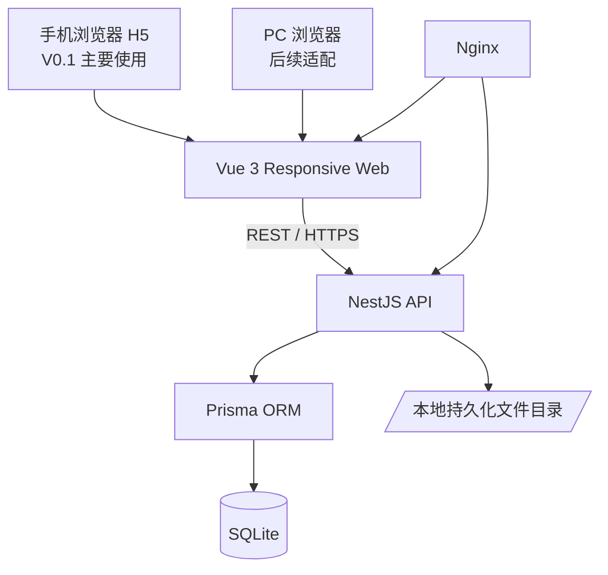

# 轴承加工厂生产流转管理 H5 — V0.1 开发落地文档

> 面向 Codex / 开发模型的实现基线。  
> **当前交付：手机 H5。未来目标：同一套 Vue Web 代码兼容 PC。**  
> 本文档是 V0.1 的产品、交互、数据模型、API、技术架构和验收标准的统一依据。实现过程中不要自行扩大业务范围；遇到文档未定义的业务规则，优先保持可扩展的数据结构，不要凭空增加复杂流程。

## 0.1 V0.1 试运行决策（2026-09-04）

当前用户需求仍处于体验确认阶段。V0.1 采用“带明确默认规则的可体验 MVP”：先实现一条真实生产流转闭环，再依据现场使用反馈调整，不等待所有远期需求确认。

本版本固定采用以下规则：

1. `Batch.startProcessId` 记录批次的实际起始工序；起始工序之前的工序为“不适用”，不参与蓝色状态、完成状态和总体进度计算。
2. `BUFFER` 只能承载 `PENDING` 任务，不能开始加工；`PENDING@BUFFER` 可通过 `assign` 移动到同工序的 `DEVICE/AREA`。
3. 完成数量、任务完成、转序是三个独立业务动作：`update-completed` 只改数量，`complete` 只结束已全部加工的任务，`transfer` 只转出已完成且未转出的数量。
4. `COMPLETED` 任务如仍有可转数量，允许继续转序。
5. 全局进度采用适用工序的加工完成量加权计算，仅用于展示，不参与状态判断。
6. 一台工作位置同一时刻只允许一个 `PROCESSING` 任务；`PAUSED` 任务释放位置，开始或恢复加工时均由后端重新校验。
7. 当前缺少真实车间布局图，开发阶段允许使用简化占位布局；真实布局到位后再校准热点，地图位置验收在此之前不视为完成。

---

## 0. Codex 执行原则

1. 当前只完整实现 **Mobile First H5**，但不得把页面、组件和业务逻辑写死为“只能手机使用”。
2. **只有一个前端项目**，未来 PC 使用通过响应式 Layout 和不同展示组件扩展；禁止新建 `mobile-web` / `pc-web` 两套业务代码。
3. 后端使用 **NestJS 单体模块化架构**，禁止引入微服务、Redis、MQ、Kafka、Elasticsearch、Kubernetes 等 V0.1 不需要的组件。
4. 数据库使用 **SQLite + Prisma**。SQLite 中状态字段使用 `String` + shared constants，不依赖数据库原生 Enum。
5. 核心数据模型必须围绕：**生产单 → 批次 → 工序任务 → 工作位置 → 转序记录**，禁止把“设备颜色”作为业务真相保存。
6. 红/绿/蓝/橙/灰是展示状态；颜色必须由业务状态计算，不允许用户直接修改颜色。
7. 所有数量变化、部分转序、下一工序创建必须在后端事务中完成，并在事务内重新校验可转数量。
8. 生产流转接口不得相信前端传入“下一工序”。下一工序必须由后端根据固定工序顺序计算。
9. 重要操作必须留下操作日志；所有写接口必须进行 DTO 校验。
10. V0.1 优先保证可运行、可测试、可部署，不为未来功能提前建设过度抽象。

---

# 1. 项目背景

客户是一家小型轴承加工制造工厂，管理人员约 5 人。现场主要通过手机查看生产状态和推进工序。

当前主要痛点：

- 无法直观看到车间每台设备当前正在加工什么。
- 同一批次可能上一工序尚未全部结束，下一工序已经开始。
- 每次转工序不希望重复录入型号、客户、批次、数量。
- 希望通过车间布局图直接点击设备并进行生产操作。
- 后续需要继续扩展生产台账、发货台账、图纸、打印、模具匹配和报价。

V0.1 不做完整 MES/ERP，而是做一个 **轻量生产流转管理系统**。

---

# 2. 产品目标

V0.1 首先跑通以下主链路：

```text
创建生产单
  ↓
生成批次
  ↓
进入当前工序 / 工作位置
  ↓
待加工
  ↓
开始加工
  ↓
完成全部或部分数量
  ↓
转下一工序
  ↓
选择下一设备/区域
  ↓
下一工序继续生产
```

用户日常最常用入口是 **车间布局图**。

---

# 3. 当前工艺流程

固定默认工艺：

```text
浇铸
  ↓
粗车
  ↓
精车
  ↓
镗孔
  ↓
去毛刺
  ↓
包装
  ↓
发货
```

V0.1 使用固定顺序，不实现可视化工艺路线编辑器。

数据库中必须保存独立的 `Process` 数据，并通过 `sort` 判断下一工序，避免把流程硬编码散落到多个页面或 Service。

初始化工序：

| sort | code           | name   |
| ---: | -------------- | ------ |
|   10 | CASTING        | 浇铸   |
|   20 | ROUGH_TURNING  | 粗车   |
|   30 | FINISH_TURNING | 精车   |
|   40 | BORING         | 镗孔   |
|   50 | DEBURRING      | 去毛刺 |
|   60 | PACKAGING      | 包装   |
|   70 | SHIPPING       | 发货   |

说明：V0.1 的“发货”只作为生产流程终点，不实现完整的发货流水/物流台账。后续再增加 `Shipment` 业务模块。

---

# 4. 车间布局

## 4.1 原始布局参考


该图片是实际工厂布局依据。

V0.1 不开发通用“上传车间图 + 拖拽编辑设备”的布局编辑器，而是：

- 使用固定布局图片作为背景。
- 使用数据库中的百分比坐标覆盖可点击热点。
- 后续再增加布局编辑功能，不影响现有数据模型。

## 4.2 已知设备/区域

明确可识别的工作位置包括：

### 精车

- 精车1
- 精车2
- 精车3
- 精车4
- 精车5
- 特精车区

### 粗车

- 粗车1
- 粗车2
- 特粗车区

### 镗孔

- 镗床1
- 镗床2
- 镗床3
- 镗床4
- 待镗区

### 其他

- 浇铸区
- 去毛刺区
- 待包装区
- 包装区
- 待发货区
- 普车

`普车` 暂时只在地图展示，V0.1 不把它自动归入某一工序的可选设备，待业务确认后再配置 `processId`。

布局图中其他无法确认业务含义的小区域，不要自行推断为新工序。

## 4.3 工作位置类型

统一使用 `Workstation` 表表示车间地图上的实体：

```text
DEVICE  实体设备
AREA    加工区域
BUFFER  待料/暂存区域
```

示例：

```text
粗车1       DEVICE  -> ROUGH_TURNING
精车2       DEVICE  -> FINISH_TURNING
浇铸区      AREA    -> CASTING
去毛刺区    AREA    -> DEBURRING
待镗区      BUFFER  -> BORING
待包装区    BUFFER  -> PACKAGING
包装区      AREA    -> PACKAGING
待发货区    BUFFER  -> SHIPPING
```

BUFFER 不属于新的工艺步骤，只代表下一工序前的物理等待位置。

---

# 5. V0.1 原型


原型用于确定信息架构和主要交互，不要求像素级复制。

**实现时车间地图以实际布局图为准，不以原型中简化后的地图位置为准。**

原型包含 4 个关键场景：

1. 车间地图。
2. 设备/工作位置详情。
3. 部分数量转下一工序。
4. 生产单列表。

---

# 6. V0.1 页面范围

## 6.1 路由

建议：

```text
/login
/workshop
/workstations/:id
/orders
/orders/new
/orders/:id
/tasks/:id/transfer
/me
```

默认登录后进入：

```text
/workshop
```

手机底部导航：

```text
车间 | 生产单 | 我的
```

PC 后续改为 Sidebar + Header，但仍使用同一路由和业务页面。

---

## 6.2 登录

第一版：

- 用户名
- 密码
- JWT 登录

不做：

- 手机验证码
- OAuth
- SSO
- Refresh Token 多端体系

账号数量很少，管理员通过 seed 或后端初始化账号即可。

---

## 6.3 车间页 `/workshop`

页面要求：

- 展示车间固定布局图。
- 可缩放、拖动。
- 在布局图上覆盖设备/区域热点。
- 热点显示设备名称和状态颜色。
- 点击热点进入工作位置详情。
- 支持触摸设备和未来 PC 鼠标操作。

颜色图例：

| 颜色 | displayStatus    | 含义                                         |
| ---- | ---------------- | -------------------------------------------- |
| 红   | PENDING          | 已安排任务但尚未开始                         |
| 绿   | PROCESSING       | 正在加工                                     |
| 蓝   | CROSS_PROCESSING | 当前工序已开始，但同批次上一工序还未全部完成 |
| 橙   | PAUSED           | 暂停/异常                                    |
| 灰   | EMPTY            | 当前无活动任务                               |

颜色只是展示层结果，数据库禁止保存 `red/green/blue` 等颜色字段。

---

## 6.4 工作位置详情 `/workstations/:id`

显示：

- 名称
- 当前状态
- 当前生产任务
- 型号
- 客户
- 批次
- 数量
- 当前工序
- 工艺流程
- 待加工队列数量（可以先只显示数量，不做复杂排序操作）

操作：

```text
开始加工
暂停
更新完成数量
转下一工序
完成本工序
```

当工作位置无任务时显示空闲状态。

V0.1 同一设备允许存在多个 `PENDING` 和 `PAUSED` 任务，但同一时刻只允许一个 `PROCESSING` 任务。暂停会释放工作位置；开始或恢复时由后端 Service 重新校验。

补充规则：

- `BUFFER` 上的任务只允许查看和重新分配，不显示“开始加工”。
- `assign` 既可将 `UNSCHEDULED` 任务分配到工作位置，也可将 `PENDING@BUFFER` 移动到同工序的 `DEVICE/AREA`。
- `start` / `resume` 必须校验目标工作位置类型不是 `BUFFER`，并在写事务中确认不存在其他 `PROCESSING` 任务。
- “转下一工序”只在 `availableToTransfer > 0` 时可用，不自动增加完成数量。
- “完成本工序”只在 `completedQuantity == plannedQuantity` 时可用。

---

## 6.5 新增生产单 `/orders/new`

字段：

```text
型号 *
客户 *
总数量 *
批次号 *
交期
起始工序 *
起始工作位置（可选）
备注
```

V0.1：

- 型号和客户使用自由文本，不建立复杂型号档案和客户档案。
- 创建 ProductionOrder 后自动创建一个 Batch。
- 起始工序允许不是“浇铸”，便于把已经在生产中的旧订单录入系统。
- 创建 Batch 时必须保存所选的 `startProcessId`。
- 起始工作位置为空时，任务状态为 `UNSCHEDULED`。
- 如果指定工作位置，创建初始 `ProcessTask`，状态为 `PENDING`。

生产单号可自动生成，例如：

```text
PO202609040001
```

批次号允许人工填写，也可以默认生成并允许修改。

---

## 6.6 生产单列表 `/orders`

手机：卡片列表。

筛选：

```text
全部
加工中
待加工
暂停
未排产
已完成
```

搜索：

```text
型号 / 客户 / 生产单号 / 批次号
```

每张卡片显示：

- 生产单号/批次
- 型号
- 客户
- 总数量
- 交期
- 当前状态
- 当前主要工序
- 简要进度

PC 后续使用表格展示，同一 API、同一业务数据，不新建 PC API。

---

## 6.7 生产单详情 `/orders/:id`

展示：

```text
生产单基本信息
批次信息
7 道工序进度
每道工序：计划数量 / 完成数量 / 当前设备 / 状态
转序历史
```

如果同一批次同时存在粗车和精车任务，要同时展示，不能只有一个 `currentProcess` 字段覆盖真实状态。

---

## 6.8 转下一工序 `/tasks/:id/transfer`

页面逻辑：

```text
当前工序：粗车
下一工序：精车

可转数量：1200
转序数量：[1200]

目标工作位置：
○ 精车1
● 精车2
○ 精车3
○ 精车4
○ 精车5

[确认转序]
```

规则：

1. 支持部分数量转序。
2. `quantity > 0`。
3. `quantity <= 当前任务已完成但尚未转出的数量`。
4. 目标工作位置必须属于后端计算出的下一工序。
5. BUFFER 可作为下一工序的目标位置，例如精车结束可先进入 `待镗区`。
6. 最后一道 `SHIPPING` 完成后生产单进入 `COMPLETED`；完整发货流水留到后续版本。
7. 转入 BUFFER 后生成下一工序的 `PENDING` Task；该 Task 必须重新分配到同工序的 DEVICE/AREA 后才能开始加工。
8. `COMPLETED` Task 只要仍有可转数量，仍允许调用转序接口。

---

# 7. 关键业务规则

## 7.1 部分转序

示例：

```text
批次 A001：2000 件
粗车已完成：1200
粗车仍加工：800
```

允许把 1200 转给精车：

```text
粗车：800 仍在加工
精车：1200 已开始
```

此时精车任务如果处于 `PROCESSING`，展示状态为：

```text
CROSS_PROCESSING / 蓝色
```

因为上一工序尚未全部完成。

---

## 7.2 可转数量

不要增加一个容易与记录失真的“可转数量”字段作为真相。

计算公式：

```text
availableToTransfer
=
ProcessTask.completedQuantity
-
SUM(Transfer.quantity WHERE fromTaskId = 当前任务)
```

转序时必须在数据库事务内重新计算，不使用前端传来的可转数量。

---

## 7.3 蓝色状态计算

`CROSS_PROCESSING` 是 display status，不是 ProcessTask 持久化状态。

简化规则：

```text
当前任务.status == PROCESSING
并且
同 Batch 的上一道工序整体完成数量 < Batch.quantity
```

如果当前工序就是 `Batch.startProcessId`，或上一道工序位于 `startProcessId` 之前，则不存在需要检查的上一工序，不显示 `CROSS_PROCESSING`。

则：

```text
CROSS_PROCESSING
```

否则仍为 `PROCESSING`。

如同一道工序有多个 ProcessTask，上一工序完成数量必须聚合计算：

```text
SUM(completedQuantity)
```

避免只检查一台设备。

---

## 7.4 工作位置显示状态优先级

工作位置当前活动任务优先展示。

建议：

```text
跨工序加工中 > 加工中 > 暂停 > 待加工 > 空闲
```

同一工作位置可同时保留多个暂停任务，但只能存在一个 `PROCESSING` 任务；位置主状态按上述优先级选择。

---

## 7.5 状态不得由前端直接修改

禁止接口：

```text
PATCH /workstation/:id { color: 'green' }
PATCH /order/:id { status: 'PROCESSING' }
```

必须通过业务动作：

```text
start
pause
update-completed
transfer
complete
assign
```

系统根据动作更新状态。

---

# 8. 技术架构

## 8.1 总体



前端只有一个 Web 应用。

---

## 8.2 技术选型

| 层             | 技术                               |
| -------------- | ---------------------------------- |
| 前端           | Vue 3 + TypeScript                 |
| 构建           | Vite                               |
| Router         | Vue Router                         |
| 状态管理       | Pinia                              |
| HTTP           | Axios                              |
| Mobile UI      | Vant                               |
| 响应式布局     | UnoCSS + CSS Media Query           |
| 后端           | NestJS                             |
| ORM            | Prisma                             |
| Database       | SQLite                             |
| API            | REST                               |
| Authentication | JWT                                |
| 密码           | bcrypt 或 argon2，选择一种统一使用 |
| Web Server     | Nginx                              |
| Deployment     | Docker Compose                     |
| Monorepo       | pnpm workspace                     |
| Backend tests  | Jest + Supertest                   |
| Frontend tests | Vitest                             |
| Key-flow E2E   | Playwright                         |

V0.1 不引入 Element Plus。未来 PC 如果需要更复杂桌面组件，可在 UI wrapper 内替换或补充，不让业务组件直接绑定第二套 UI 框架。

---

# 9. Monorepo 目录

```text
bearing-factory/
├── apps/
│   ├── web/
│   │   ├── src/
│   │   │   ├── api/
│   │   │   ├── assets/
│   │   │   ├── components/
│   │   │   │   ├── ui/
│   │   │   │   ├── responsive/
│   │   │   │   └── business/
│   │   │   ├── composables/
│   │   │   ├── layouts/
│   │   │   │   ├── AppLayout.vue
│   │   │   │   ├── MobileLayout.vue
│   │   │   │   └── DesktopLayout.vue
│   │   │   ├── router/
│   │   │   ├── stores/
│   │   │   ├── styles/
│   │   │   ├── types/
│   │   │   └── views/
│   │   │       ├── login/
│   │   │       ├── workshop/
│   │   │       ├── production/
│   │   │       └── mine/
│   │   └── package.json
│   │
│   └── server/
│       ├── prisma/
│       │   ├── schema.prisma
│       │   ├── migrations/
│       │   └── seed.ts
│       ├── src/
│       │   ├── auth/
│       │   ├── users/
│       │   ├── processes/
│       │   ├── workstations/
│       │   ├── production-orders/
│       │   ├── batches/
│       │   ├── process-tasks/
│       │   ├── transfers/
│       │   ├── operation-logs/
│       │   ├── prisma/
│       │   └── app.module.ts
│       └── package.json
│
├── packages/
│   └── shared/
│       └── src/
│           ├── constants/
│           ├── types/
│           └── index.ts
│
├── data/
│   ├── db/
│   └── uploads/
│
├── nginx/
│   └── default.conf
├── docker-compose.yml
├── pnpm-workspace.yaml
├── package.json
└── README.md
```

---

# 10. 前端响应式设计

## 10.1 目标

当前完整适配：

```text
360px ~ 480px Mobile
```

顺带保证：

```text
768px ~ 1199px 不溢出、不不可用
```

未来专门优化：

```text
>= 1200px Desktop
```

推荐断点：

```text
< 768px         Mobile
768 ~ 1199px    Tablet
>= 1200px       Desktop
```

---

## 10.2 Layout

`AppLayout.vue` 负责根据屏幕宽度选择布局。

Mobile：

```text
Top Bar
Content
Bottom Navigation
```

Desktop 后续：

```text
Header
Sidebar | Content
```

不要在每个业务页面直接写 `window.innerWidth`，统一封装：

```text
useResponsive()
```

提供：

```ts
isMobile
isTablet
isDesktop
```

---

## 10.3 UI wrapper

V0.1 可以使用 Vant，但业务层不要到处直接依赖复杂移动组件。

封装：

```text
AppButton
AppDialog
AppDrawer
AppInput
AppSelect
AppDatePicker
AppEmpty
AppLoading
ResponsivePanel
```

例如：

```text
Mobile ResponsivePanel -> Bottom Sheet / Fullscreen Page
Desktop ResponsivePanel -> Right Drawer
```

业务组件：

```text
WorkshopMap
WorkstationDetail
ProcessFlow
StatusTag
ProductionOrderCard
ProductionOrderList
TransferForm
QuantityProgress
```

未来 PC 主要替换展示层，不重写数据请求、表单状态和业务逻辑。

---

# 11. 车间地图技术实现

## 11.1 背景与热点分离

禁止直接在 PNG 上修改颜色。

实现：

```text
MapViewport
  └── WorkshopMap
        ├── BackgroundImage
        └── WorkstationHotspot × N
```

背景：

```text
workshop-layout.png
```

热点：数据库坐标。

坐标全部使用相对百分比：

```ts
{
  x: 42.5,
  y: 35.2,
  width: 6.0,
  height: 9.0
}
```

CSS：

```css
left: 42.5%;
top: 35.2%;
width: 6%;
height: 9%;
```

禁止把位置保存为设备相关的固定屏幕像素。

---

## 11.2 交互

优先基于 Pointer Events / 可同时兼容 touch + mouse 的实现。

需要：

```text
拖动
缩放
点击热点
双指缩放（Mobile）
鼠标滚轮缩放（未来 Desktop）
```

地图容器维护：

```text
scale
translateX
translateY
```

热点跟随同一变换层。

---

## 11.3 Seed 坐标

V0.1 seed 可以先按原图位置录入近似百分比，然后实际运行后微调。

不要把下面的初始值视为像素级最终值：

```text
精车4      x≈7   y≈5
精车5      x≈18  y≈5
普车       x≈28  y≈5
粗车2      x≈38  y≈5
粗车1      x≈48  y≈5
精车3      x≈7   y≈17
精车2      x≈7   y≈30
精车1      x≈18  y≈30
特精车区   x≈29  y≈30
特粗车区   x≈39  y≈30
镗床2      x≈7   y≈43
镗床1      x≈18  y≈43
待镗区     x≈29  y≈46
镗床4      x≈7   y≈56
镗床3      x≈18  y≈56
去毛刺区   x≈8   y≈76
待包装区   x≈23  y≈81
包装区     x≈28  y≈81
待发货区   x≈35  y≈81
浇铸区     x≈60  y≈4
```

宽高要按原图对应矩形比例设置并视觉校准。

---

# 12. Shared constants

建议 `packages/shared` 定义，不在前后端重复手写字符串。

示意：

```ts
export const ProcessCode = {
  CASTING: 'CASTING',
  ROUGH_TURNING: 'ROUGH_TURNING',
  FINISH_TURNING: 'FINISH_TURNING',
  BORING: 'BORING',
  DEBURRING: 'DEBURRING',
  PACKAGING: 'PACKAGING',
  SHIPPING: 'SHIPPING',
} as const

export const WorkstationType = {
  DEVICE: 'DEVICE',
  AREA: 'AREA',
  BUFFER: 'BUFFER',
} as const

export const TaskStatus = {
  UNSCHEDULED: 'UNSCHEDULED',
  PENDING: 'PENDING',
  PROCESSING: 'PROCESSING',
  PAUSED: 'PAUSED',
  COMPLETED: 'COMPLETED',
} as const

export const DisplayStatus = {
  EMPTY: 'EMPTY',
  PENDING: 'PENDING',
  PROCESSING: 'PROCESSING',
  CROSS_PROCESSING: 'CROSS_PROCESSING',
  PAUSED: 'PAUSED',
} as const
```

SQLite 模型中存字符串，Nest DTO / service 校验值是否合法。

---

# 13. Prisma 数据模型草案

> 这是 V0.1 的推荐基线。Codex 可以按 Prisma 当前版本语法做必要的小幅适配，但不可改变核心关系。

```prisma
generator client {
  provider = "prisma-client-js"
}

datasource db {
  provider = "sqlite"
  url      = env("DATABASE_URL")
}

model User {
  id             Int               @id @default(autoincrement())
  username       String            @unique
  passwordHash   String
  name           String
  role           String            @default("USER")
  isActive       Boolean           @default(true)
  createdAt      DateTime          @default(now())
  updatedAt      DateTime          @updatedAt

  createdOrders  ProductionOrder[] @relation("OrderCreator")
  transfers      Transfer[]
  operationLogs  OperationLog[]
}

model WorkshopLayout {
  id             Int           @id @default(autoincrement())
  name           String
  imagePath      String
  originalWidth  Int?
  originalHeight Int?
  isActive       Boolean       @default(true)
  createdAt      DateTime      @default(now())
  updatedAt      DateTime      @updatedAt

  workstations   Workstation[]
}

model Process {
  id           Int           @id @default(autoincrement())
  code         String        @unique
  name         String
  sort         Int
  enabled      Boolean       @default(true)
  createdAt    DateTime      @default(now())
  updatedAt    DateTime      @updatedAt

  workstations Workstation[]
  tasks        ProcessTask[]
  startedBatches Batch[]      @relation("BatchStartProcess")

  @@index([sort])
}

model Workstation {
  id          Int              @id @default(autoincrement())
  layoutId    Int
  processId   Int?
  code        String           @unique
  name        String
  type        String
  x           Float
  y           Float
  width       Float?
  height      Float?
  enabled     Boolean          @default(true)
  sort        Int              @default(0)
  createdAt   DateTime         @default(now())
  updatedAt   DateTime         @updatedAt

  layout      WorkshopLayout   @relation(fields: [layoutId], references: [id])
  process     Process?         @relation(fields: [processId], references: [id])
  tasks       ProcessTask[]

  @@index([layoutId])
  @@index([processId])
}

model ProductionOrder {
  id          Int        @id @default(autoincrement())
  orderNo     String     @unique
  model       String
  customer    String
  quantity    Int
  dueDate     DateTime?
  status      String     @default("UNSCHEDULED")
  remark      String?
  createdById Int
  createdAt   DateTime   @default(now())
  updatedAt   DateTime   @updatedAt

  createdBy   User       @relation("OrderCreator", fields: [createdById], references: [id])
  batches     Batch[]

  @@index([status])
  @@index([model])
  @@index([customer])
  @@index([dueDate])
}

model Batch {
  id          Int              @id @default(autoincrement())
  orderId     Int
  startProcessId Int
  batchNo     String
  quantity    Int
  status      String           @default("UNSCHEDULED")
  createdAt   DateTime         @default(now())
  updatedAt   DateTime         @updatedAt

  order       ProductionOrder  @relation(fields: [orderId], references: [id], onDelete: Cascade)
  startProcess Process         @relation("BatchStartProcess", fields: [startProcessId], references: [id])
  tasks       ProcessTask[]
  transfers   Transfer[]

  @@unique([orderId, batchNo])
  @@index([startProcessId])
  @@index([status])
}

model ProcessTask {
  id                Int          @id @default(autoincrement())
  batchId           Int
  processId         Int
  workstationId     Int?
  plannedQuantity   Int
  completedQuantity Int          @default(0)
  status            String       @default("PENDING")
  startedAt         DateTime?
  completedAt       DateTime?
  createdAt         DateTime     @default(now())
  updatedAt         DateTime     @updatedAt

  batch             Batch        @relation(fields: [batchId], references: [id], onDelete: Cascade)
  process           Process      @relation(fields: [processId], references: [id])
  workstation       Workstation? @relation(fields: [workstationId], references: [id])

  outgoingTransfers Transfer[]   @relation("TransferFromTask")
  incomingTransfers Transfer[]   @relation("TransferToTask")

  @@index([batchId, processId])
  @@index([workstationId, status])
  @@index([status])
}

model Transfer {
  id          Int         @id @default(autoincrement())
  requestId   String      @unique
  batchId     Int
  fromTaskId  Int
  toTaskId    Int
  quantity    Int
  operatorId  Int
  createdAt   DateTime    @default(now())

  batch       Batch       @relation(fields: [batchId], references: [id], onDelete: Cascade)
  fromTask    ProcessTask @relation("TransferFromTask", fields: [fromTaskId], references: [id])
  toTask      ProcessTask @relation("TransferToTask", fields: [toTaskId], references: [id])
  operator    User        @relation(fields: [operatorId], references: [id])

  @@index([fromTaskId])
  @@index([toTaskId])
  @@index([batchId])
}

model OperationLog {
  id          Int      @id @default(autoincrement())
  userId      Int
  action      String
  entityType  String
  entityId    Int?
  payload     String?
  createdAt   DateTime @default(now())

  user        User     @relation(fields: [userId], references: [id])

  @@index([entityType, entityId])
  @@index([createdAt])
}
```

说明：

- `OperationLog.payload` 存 JSON 字符串，避免把 MVP 绑定到特定 SQLite JSON 能力。
- `ProductionOrder.status` / `Batch.status` 是后端计算并维护的派生状态缓存，禁止客户端直接编辑。
- `ProcessTask.completedQuantity` 表示该任务已实际完成加工的数量。
- 已转出数量以 `Transfer` 汇总为准。
- 一个 Batch 的同一 Process 可以存在多个 ProcessTask，从而允许同一道工序分配给多台设备。

---

# 14. 后端模块

```text
AuthModule
UsersModule
ProcessesModule
WorkstationsModule
ProductionOrdersModule
BatchesModule
ProcessTasksModule
TransfersModule
OperationLogsModule
PrismaModule
```

核心业务逻辑不要放 Controller。

重点 Service：

```text
ProductionOrderService
ProcessTaskService
ProductionFlowService
WorkstationStatusService
OperationLogService
```

其中 `ProductionFlowService` 负责：

```text
计算下一工序
校验目标工作位置
计算可转数量
部分转序
创建/合并下一工序 Task
重新计算 Batch / Order 状态
事务
```

---

# 15. REST API

统一前缀：

```text
/api
```

## 15.1 Auth

```text
POST /api/auth/login
GET  /api/auth/me
```

---

## 15.2 Process

```text
GET /api/processes
```

返回固定流程数据。

---

## 15.3 Workstation

```text
GET /api/workstations/map
GET /api/workstations/:id
GET /api/workstations?processCode=FINISH_TURNING
```

`/map` 返回地图所需的轻量数据：

```json
[
  {
    "id": 1,
    "code": "ROUGH_01",
    "name": "粗车1",
    "type": "DEVICE",
    "x": 48,
    "y": 5,
    "width": 5,
    "height": 9,
    "displayStatus": "PROCESSING",
    "activeTask": {
      "id": 101,
      "model": "6208",
      "customer": "ABC轴承",
      "batchNo": "A001"
    }
  }
]
```

---

## 15.4 Production Order

```text
GET  /api/production-orders
POST /api/production-orders
GET  /api/production-orders/:id
```

列表支持：

```text
page
pageSize
status
keyword
```

`keyword` 搜索：

```text
orderNo / model / customer / batchNo
```

---

## 15.5 Process Task

```text
POST /api/process-tasks/:id/assign
POST /api/process-tasks/:id/start
POST /api/process-tasks/:id/pause
POST /api/process-tasks/:id/resume
POST /api/process-tasks/:id/update-completed
POST /api/process-tasks/:id/transfer
POST /api/process-tasks/:id/complete
```

注意：根据实际状态机判断操作是否合法。

动作语义：

- `assign`：支持 `UNSCHEDULED -> PENDING`，以及 `PENDING@BUFFER -> PENDING@DEVICE/AREA`；目标位置必须属于当前工序。
- `start`：仅允许 `PENDING@DEVICE/AREA -> PROCESSING`，并重新校验工作位置不存在其他 `PROCESSING` 任务。
- `pause`：允许 `PROCESSING -> PAUSED` 并释放工作位置。
- `resume`：仅允许 `PAUSED -> PROCESSING`，并重新校验工作位置不存在其他 `PROCESSING` 任务。
- `update-completed`：只修改累计完成数量，不自动完成、不自动转序。
- `complete`：仅允许 `completedQuantity == plannedQuantity` 的 `PROCESSING/PAUSED` Task 进入 `COMPLETED`。
- `transfer`：允许从 `PROCESSING/PAUSED/COMPLETED` Task 转出可转数量；不修改 `completedQuantity`。

### update-completed

示例：

```json
{
  "completedQuantity": 1200
}
```

规则：

```text
0 <= completedQuantity <= plannedQuantity
completedQuantity 不允许小于已经转出的总数量
```

### transfer

示例：

```json
{
  "requestId": "client-generated-unique-id",
  "quantity": 1200,
  "targetWorkstationId": 8
}
```

不接受：

```text
toProcessId
toProcessCode
```

后端自己判断下一工序。

---

# 16. 转序事务

必须使用：

```ts
prisma.$transaction(...)
```

逻辑顺序：

```text
1. 查询当前 ProcessTask + Batch + Process
2. 锁定业务上下文（SQLite 中通过事务串行写入保证）
3. 根据 Process.sort 查询下一道 enabled Process
4. 校验不是最后一道，或执行终点逻辑
5. 校验 targetWorkstationId 属于下一工序
   - 若目标是 BUFFER，只能创建/合并 PENDING Task
   - 若目标是 DEVICE/AREA，仍先创建/合并 PENDING Task，由用户显式 start
6. 汇总当前任务已有 Transfer
7. available = completedQuantity - transferredQuantity
8. 校验 0 < quantity <= available
9. 查找目标侧可合并的 ProcessTask
10. 若存在同 batch + process + workstation 且未完成任务，则增加 plannedQuantity
11. 否则创建新的 ProcessTask
12. 创建 Transfer(requestId unique)
13. 更新必要的 task 状态
14. 重新计算 Batch.status
15. 重新计算 ProductionOrder.status
16. 写 OperationLog
17. commit
```

如果同一个 `requestId` 重复提交：

- 不得重复转数量。
- 返回第一次请求的结果或明确返回幂等冲突。

前端同时需要 button loading，防止用户重复点击。

---

# 17. 状态机

## 17.1 ProcessTask

```text
UNSCHEDULED
    │ assign
    ▼
PENDING
    │ start
    ▼
PROCESSING
  │       │
 pause    complete
  │       │
  ▼       ▼
PAUSED   COMPLETED
  │
 resume
  │
  ▼
PROCESSING
```

`update-completed` 允许在 PROCESSING / PAUSED 情况下调用。

`complete` 仅在 `completedQuantity == plannedQuantity` 时允许；`COMPLETED` 不代表数量已经全部转出。只要 `availableToTransfer > 0`，`PROCESSING / PAUSED / COMPLETED` 均允许执行 `transfer`。

任务位于 BUFFER 时保持 `PENDING`，通过 `assign` 移动到同工序 DEVICE/AREA，不产生新的工序步骤或 Transfer。

不能任意跳状态。

---

## 17.2 Order / Batch 状态

由后端根据 Task 聚合计算，不接受客户端直接设置。

建议：

```text
UNSCHEDULED
WAITING
PROCESSING
PAUSED
COMPLETED
```

大致规则：

```text
没有已分配 Task -> UNSCHEDULED
有 PENDING 且没有 active Task -> WAITING
存在 PROCESSING -> PROCESSING
不存在 PROCESSING 但存在 PAUSED -> PAUSED
最终工序完成数量达到 batch.quantity -> COMPLETED
```

ProductionOrder 聚合所有 Batch。

列表中的总体进度仅用于展示：

```text
progressPercent
=
SUM(从 Batch.startProcessId 到 SHIPPING 的各工序完成数量)
/
(Batch.quantity × 适用工序数量)
× 100%
```

- 每道工序先聚合同 Batch、同 Process 的全部 Task，且聚合值最大按 `Batch.quantity` 计。
- 起始工序之前的工序不进入分母。
- 状态判断不得依赖该百分比；详情页仍以每道工序的数量和状态为准。

---

# 18. 后端基础规范

NestJS：

- 全局 `ValidationPipe`。
- `whitelist: true`。
- `forbidNonWhitelisted: true`。
- API 返回结构保持统一。
- Controller 只做参数接收和调用 Service。
- 异常使用明确 HTTP status / business message。
- JWT Guard 保护业务 API。
- 密码只存 hash。
- CORS 在开发阶段按需开放；生产同域部署优先。
- 操作日志不记录密码/token。

建议 API success 直接返回资源 DTO，不强制套多层 `data.data`。

---

# 19. 前端状态和请求

Pinia 只保存真正跨页面状态：

```text
user/auth
当前 layout 基础信息
少量全局 UI 状态
```

生产单列表、设备详情等服务端数据不要无脑长期缓存到 Pinia；由页面 composable 管理请求即可。

建议：

```text
useAuth()
useWorkshopMap()
useProductionOrders()
useProductionOrderDetail()
useWorkstationDetail()
useTransferTask()
```

Axios interceptor：

- 自动携带 JWT。
- 401 清理登录态并跳 `/login`。
- 统一错误提示。

---

# 20. 地图状态计算职责

推荐后端直接返回：

```text
displayStatus
activeTask summary
```

前端只负责：

```text
DisplayStatus -> CSS class / 色值
```

不要在多个 Vue 组件里重复判断蓝色状态。

后端统一由：

```text
WorkstationStatusService
```

计算。

---

# 21. Mobile First + PC 扩展要求

## 当前必须做到

- 375 / 390 / 414 / 430 宽度正常使用。
- 不出现固定 `375px` 页面宽度。
- 输入区域按钮适合触摸操作。
- 地图支持拖动缩放。
- 列表以卡片为主。

## 现在只需要保证不坏

- 768px 以上页面不溢出、不出现巨大拉伸。
- 内容设置合理 max-width。

## 未来 PC 预留

```text
Mobile BottomNav -> Desktop Sidebar
Mobile OrderCard -> Desktop OrderTable
Mobile BottomSheet -> Desktop RightDrawer
同一 WorkshopMap -> 更大可视区域 + mouse 操作
```

业务 API / 数据模型不做 mobile/desktop 区分。

禁止出现：

```text
/api/mobile/*
/api/pc/*
```

---

# 22. SQLite 落地要求

数据库地址：

```env
DATABASE_URL=file:/data/production.db
```

建议生产开启 WAL。

V0.1 并发人数很少，SQLite 足够。

重要要求：

- 转序、完成数量等关键写操作必须事务化。
- 为常用过滤字段建立 index。
- 每日备份数据库。
- 如果启用 WAL，备份不能只简单复制正在使用的 `.db` 文件；使用 SQLite `.backup` 或 `VACUUM INTO` 等一致性备份方式。

未来如果人数、厂区或自动设备上报显著增长，再迁移 PostgreSQL/MySQL。业务代码通过 Prisma 隔离，不提前迁移。

---

# 23. Docker / 部署

建议 V0.1 只有两个运行服务：

```text
nginx
server
```

Vue build 后静态文件由 Nginx 提供。

```text
Internet
   ↓
Nginx
   ├── /          -> Vue dist
   └── /api       -> NestJS:3000
                         ↓
                       SQLite
```

宿主持久化：

```text
/opt/bearing-factory/data/
├── production.db
└── uploads/
```

Docker volume 必须映射该目录，重新构建/启动容器不能删除生产数据。

环境变量：

```env
NODE_ENV=production
PORT=3000
DATABASE_URL=file:/data/production.db
JWT_SECRET=replace-with-long-random-value
JWT_EXPIRES_IN=7d
UPLOAD_DIR=/data/uploads
```

前端生产环境 API：

```env
VITE_API_BASE_URL=/api
```

---

# 24. Seed 数据

`prisma/seed.ts` 至少创建：

1. 默认管理员账号。
2. 7 道 Process。
3. 一个 `WorkshopLayout`，imagePath 指向前端固定布局资源或静态资源 URL。
4. 已确认的 Workstation。

开发环境可以附带 3 个演示生产单：

```text
A001 6208 ABC轴承 5000 加工中
A002 6210 DEF轴承 3000 跨工序加工
A003 6306 GHI轴承 1500 待加工
```

生产 seed 不要重复插入演示生产数据。

---

# 25. V0.1 暂不实现

以下功能保留数据扩展空间，但本版本不要开发：

- PC 专用高密度页面。
- 通用车间布局编辑器。
- 多厂区。
- 多工艺路线模板。
- 客户档案管理。
- 型号档案管理。
- 发货流水台账。
- 图纸/PDF 上传、打印模板。
- 模具库。
- 自动匹配模具。
- 重量公式。
- 快速报价。
- 复杂 RBAC。
- WebSocket 实时推送。
- Redis / MQ。

地图和列表 V0.1 使用普通 API 刷新即可。设备状态变更操作成功后主动重新请求相关数据。

---

# 26. 后续扩展边界

## 26.1 发货

后续新增：

```text
Shipment
ShipmentItem
```

支持一个订单多次发货，不修改现有生产流转核心模型。

## 26.2 图纸

后续：

```text
ProductDrawing / FileRecord
```

文件放 `/data/uploads` 或迁移对象存储，数据库只保存 metadata/path。

## 26.3 型号和工艺

后续从：

```text
ProductionOrder.model String
```

扩展为：

```text
ProductModel
ProcessRouteTemplate
```

但 V0.1 不提前增加复杂表。

## 26.4 模具和报价

独立模块：

```text
Mold
MoldRule
MaterialPrice
Quote
QuoteItem
```

不要污染当前生产流转 Service。

---

# 27. 测试重点

## 27.1 后端单元/集成测试必须覆盖

### 创建生产单

- 创建 order + batch。
- 有起始 workstation 时创建 PENDING task。
- 无 workstation 时正确显示未排产。

### Task 状态

- PENDING -> PROCESSING。
- PROCESSING -> PAUSED。
- PAUSED -> PROCESSING。
- 非法状态转换拒绝。

### 完成数量

- 不可大于 plannedQuantity。
- 不可小于已转出数量。

### 部分转序

场景：

```text
planned = 2000
completed = 1200
transfer = 1200
```

验证：

- 生成下一工序 task 1200。
- Transfer 正确。
- 可转数量变为 0。
- 当前工序仍可继续完成剩余 800。
- 下一工序开始后 displayStatus 为 CROSS_PROCESSING。

### 防止超转

```text
available = 800
transfer = 1000
```

必须失败，且所有数据不变化。

### 重复 requestId

不得重复转序。

### 目标设备校验

粗车 -> 精车时不能选择镗床。

### 最后工序

SHIPPING 完成后正确聚合 Batch/Order 状态。

---

## 27.2 E2E 主链路

Playwright 至少完成一条：

```text
登录
→ 创建生产单
→ 打开车间
→ 查看粗车任务
→ 开始加工
→ 更新完成数量 1200
→ 转 1200 到精车2
→ 打开精车2
→ 开始加工
→ 验证蓝色跨工序状态
→ 生产单详情看到两个工序并行状态
```

---

# 28. V0.1 验收标准

只有以下全部满足才算 V0.1 完成：

- [ ] 手机浏览器可以登录。
- [ ] 首页可以看到实际车间布局。
- [ ] 地图可以拖动和缩放。
- [ ] 所有已配置设备/区域热点位置基本正确。
- [ ] 点击设备可以查看当前生产任务。
- [ ] 可以创建生产单和默认批次。
- [ ] 可以从任意起始工序录入已有生产任务。
- [ ] 可以把任务分配到设备。
- [ ] 可以开始、暂停、恢复加工。
- [ ] 可以维护本工序完成数量。
- [ ] 可以只转部分数量到下一工序。
- [ ] 转序不要求重复输入型号、客户、批次。
- [ ] 下一工序设备只能选择正确工序的工作位置。
- [ ] 上一道未全部完成、下一道已加工时显示蓝色。
- [ ] 生产单列表可以按状态查看。
- [ ] 生产单详情能同时显示多个工序的实际数量状态。
- [ ] 关键操作有 OperationLog。
- [ ] 转序和数量变更测试通过。
- [ ] SQLite 数据目录持久化。
- [ ] `pnpm build` 成功。
- [ ] Docker Compose 可部署启动。
- [ ] 768px 以上打开页面不会严重变形，为后续 PC 保留结构。

---

# 29. 推荐开发顺序

需求仍需通过现场体验确认，因此采用纵向闭环优先。不要先横向铺开所有页面，再到最后才验证部分转序。

## Phase 1 — 工程骨架

- pnpm workspace。
- Vue3/Vite/TS。
- NestJS。
- shared package。
- Prisma + SQLite。
- Docker Compose / Nginx 基础配置。
- lint / format / test scripts。

完成标准：前后端均可启动，web 可以请求 `/api/health`。

## Phase 2 — 第一条真实业务闭环

- Prisma schema。
- migration。
- seed Process / WorkshopLayout / Workstation / admin。
- JWT 登录。
- 创建生产单和默认 Batch，保存 `startProcessId`。
- 初始任务分配、开始、更新完成数量。
- 部分转序到下一工序。
- 下一工序开始后计算蓝色状态。
- 转序事务、幂等 requestId、OperationLog 和核心集成测试。

完成标准：可完成“登录 → 创建生产单 → 粗车完成部分数量 → 转精车 → 精车开始 → 显示蓝色”的端到端业务闭环。

## Phase 3 — 查询页面和车间操作

- WorkshopMap。
- 固定布局图。
- hotspot 百分比坐标。
- pan / zoom。
- status color。
- Workstation detail。
- Create order。
- Batch 自动创建。
- 起始工序和起始位置。
- Order list / detail。
- 待加工队列和 BUFFER 重新分配。

完成标准：手机上可从车间地图和生产单两个入口完成日常查询与操作；真实布局图未提供时，地图热点精度暂不验收。

## Phase 4 — 现场体验迭代

- 由实际使用者走查核心链路。
- 确认录入字段、队列顺序、BUFFER 使用方式和完成数量录入习惯。
- 确认错误数据的修改、撤销或作废需求。
- 确认一台设备同时加工多个批次、返工、跳工序等真实边界。

完成标准：将现场反馈转换成明确规则，避免凭想象扩展业务。

## Phase 5 — 工序状态补齐

- assign/start/pause/resume/update-completed/complete。
- OperationLog。
- 聚合状态。

完成标准：设备颜色随业务动作正确变化。

## Phase 6 — 部分转序

- ProductionFlowService。
- Transfer transaction。
- 转序页面。
- 跨工序蓝色计算。
- 幂等 requestId。

若 Phase 2 已按要求交付，此阶段只补齐多设备拆分、重复转序和更多边界场景，不再首次实现核心链路。

## Phase 7 — 响应式与质量

- Mobile 细节。
- Tablet/Desktop 不崩。
- Vitest/Jest/Playwright。
- Docker 部署。
- SQLite backup 文档。

---

# 30. 推荐 package scripts

根目录：

```json
{
  "scripts": {
    "dev": "pnpm -r --parallel dev",
    "build": "pnpm -r build",
    "lint": "pnpm -r lint",
    "test": "pnpm -r test",
    "typecheck": "pnpm -r typecheck"
  }
}
```

Server：

```text
prisma:generate
prisma:migrate
prisma:seed
```

不要在生产容器启动时无条件重建数据库或清空数据。

---

# 31. Codex 最终交付要求

实现完成后必须输出：

1. 实际实现的目录结构。
2. 数据库 schema 和 migration 说明。
3. Seed 账号和开发数据说明。
4. 本地启动命令。
5. Docker 部署命令。
6. 已完成 API 清单。
7. 已完成页面清单。
8. 自动化测试结果。
9. 与本文档不一致的地方及原因。
10. 尚未实现/需要客户确认的业务问题。

不要把“页面能打开”视为完成。核心验收是：

> **一个批次可以在车间布局中，从当前设备完成部分数量，并在不重复输入型号/客户/批次的情况下转到下一工序，且上一工序未全部结束时下一工序正确显示蓝色。**

---

# 32. 当前需要保留的业务待确认项

以下事项不阻塞 V0.1，但不要擅自做复杂规则：

1. `普车` 最终属于粗车、精车还是两者都可用。
2. 特粗车区/特精车区是否需要细分具体设备。
3. 图中除已识别区域外是否还有生产性工作位置。
4. 同一设备是否允许现实中同时加工两个批次；V0.1 默认只允许一个活动任务。
5. 发货是否允许一单多次发货；后续发货模块默认应按“允许”设计。
6. 是否存在返工、退回上一工序、跳工序；V0.1 不实现。
7. 是否存在不同型号不同工艺路线；V0.1 使用固定 7 道工序。

试运行阶段还需通过实际操作观察：

8. 完成数量更习惯录入累计值还是本次增量；V0.1 默认使用累计值。
9. 待加工队列是否需要人工排序；V0.1 默认按 `createdAt` 顺序展示，不做拖拽排序。
10. 录错生产单后的修改、撤销、作废边界；核心流转闭环验证前不实现复杂冲销。
11. 列表总体进度是否符合现场理解；V0.1 同时展示分工序数量，避免只依赖百分比。

这些事项后续确认后，应通过扩展配置/业务模块解决，不要破坏现有核心数据模型。
